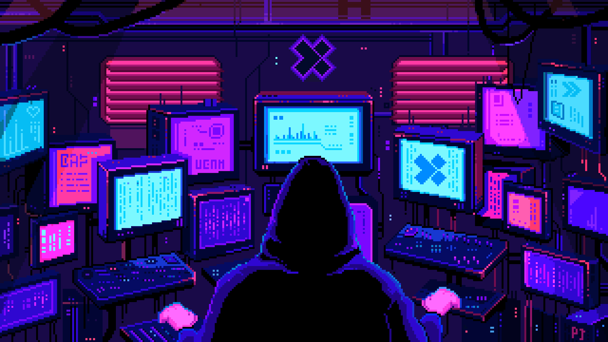
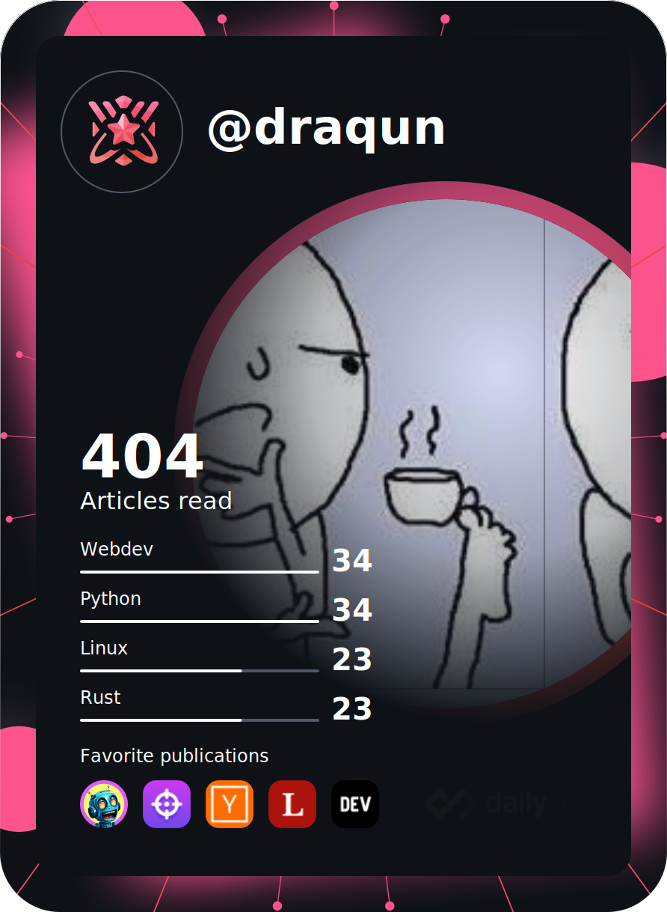

Background GIF by quynhtran1510 from [in.cdgdbentre.edu.vn](https://in.cdgdbentre.edu.vn/pixel-art-gif-wallpaper-idrxffh4/)

 &nbsp;

## 💻 My Tech Stack:

## 📖 Want to learn:

## 🏆 My Stats:

&nbsp;&nbsp;
&nbsp;&nbsp;

## 🎮 When I'm AFK:

 &nbsp;
 &nbsp;
 &nbsp;
 &nbsp;
 &nbsp;
 &nbsp;

